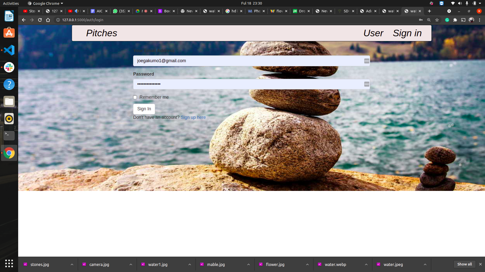
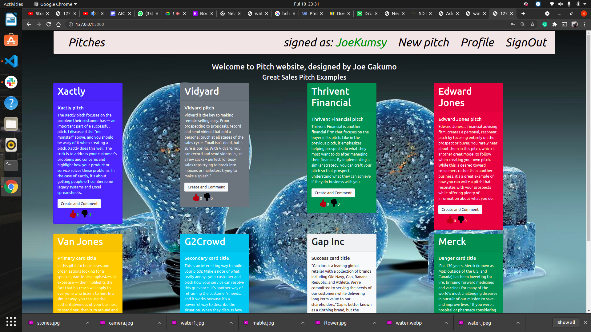
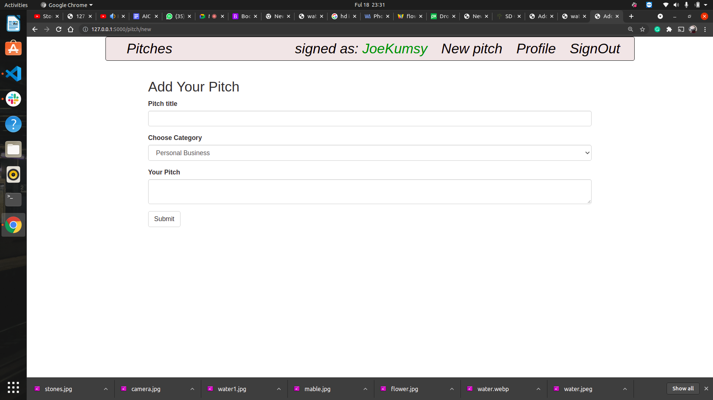
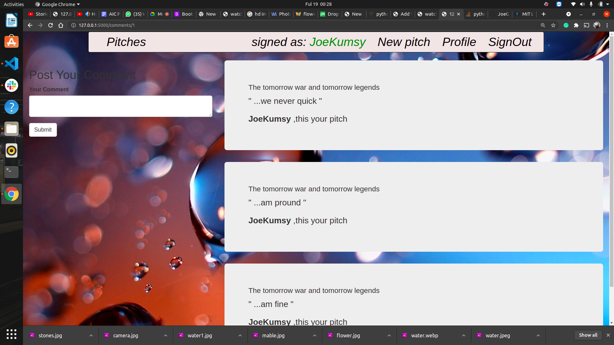

# Pitch Generation App
### this application was created and designed by ***Joseph Gakumo Munyui***
# description
* This is an application that allows users to use that one minute wisely. The users will submit their one minute pitches and other users will vote on them and leave comments to give their feedback on them.The pitches are organized by category. 

# setup requirements
* Git
* Web_browser
* Flask (1.1.2)
* pip
* Python 3.8
# setup Installation
* Copy the github repository url
*  Clone to your computer
* Open terminal and navigate to the directory of * the project you just cloned to your computer
* Run the following command to start the server * * using virtual environment
* python3.8 -m venv --without-pip virtual
* source virtual/bin/activate
curl https://bootstrap.pypa.io/get-pip.py | python
* pip install --force-reinstall flask==1.1.2
* chmod a+x start.sh
# Technology
* HTML
* CSS
- Bootstrap
- Python
- Flask
* markdown2
# live link
Access this site via <a href=" ">Pitch app</a>
<!-- screenshot -->

# Licence 
<a href="https://choosealicense.com/licenses/mit/#">MIT licence</a>
MIT License

Copyright (c) [2021] [Joseph Gakumo Munyui]

Permission is hereby granted, free of charge, to any person obtaining a copy
of this software and associated documentation files (the "Software"), to deal
in the Software without restriction, including without limitation the rights
to use, copy, modify, merge, publish, distribute, sublicense, and/or sell
copies of the Software, and to permit persons to whom the Software is
furnished to do so, subject to the following conditions:

The above copyright notice and this permission notice shall be included in all
copies or substantial portions of the Software.

THE SOFTWARE IS PROVIDED "AS IS", WITHOUT WARRANTY OF ANY KIND, EXPRESS OR
IMPLIED, INCLUDING BUT NOT LIMITED TO THE WARRANTIES OF MERCHANTABILITY,
FITNESS FOR A PARTICULAR PURPOSE AND NONINFRINGEMENT. IN NO EVENT SHALL THE
AUTHORS OR COPYRIGHT HOLDERS BE LIABLE FOR ANY CLAIM, DAMAGES OR OTHER
LIABILITY, WHETHER IN AN ACTION OF CONTRACT, TORT OR OTHERWISE, ARISING FROM,
OUT OF OR IN CONNECTION WITH THE SOFTWARE OR THE USE OR OTHER DEALINGS IN THE
SOFTWARE.

- <a href="#">&copy; 2021 JoeGakumo </a>
# screenshot

